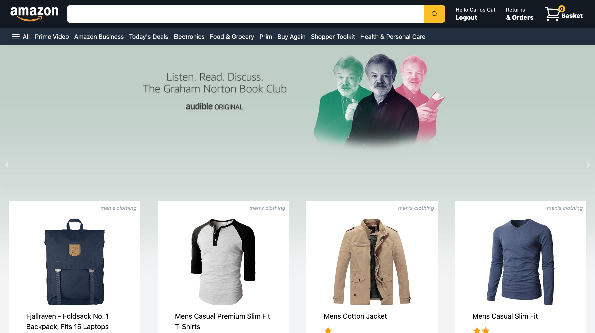
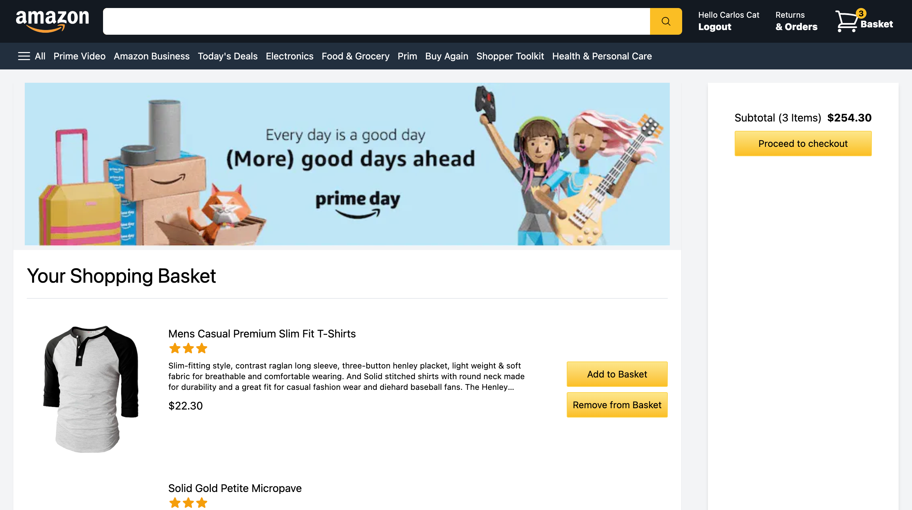

# Amazon Clone

This is a project to create a clone of Amazon for learning purposes. I used Next.js and Tailwind CSS to make the front-end. For authentication I used Next Authentication and allow users to login using their Google credentials. The products listed are from [Fake Store API](https://fakestoreapi.com/). I implemented redux to keep track of the cart and firebase to keep track of users orders. For checkout I've used Stripe and created a webhook to listen to the checkout and post the order to Firestore.  

## Overview

Users should be able to
- Log in using their Google account (Demo account provided also)
- View results from Fake Store API in a dynamic mobile responsive layout
- Add & remove items from their basket
- Checkout using Stripe Checkout (For demo use Stripe test card 4242 4242 4242 4242)
- View all past orders

### Screenshot

### Links

- Live Site URL: [Amazon 2.0](https://amazon-clone-mickmaratta.vercel.app/)

### Built with

- [React](https://reactjs.org/)
- [Next.js](https://nextjs.org/)
- [Tailwind](https://tailwindcss.com/)
- [Heroicons](https://heroicons.com/)
- [Stripe](https://stripe.com/en-ca)
- [Firebase](https://firebase.google.com/)
- [Redux](https://redux.js.org/)
- [Axios](https://www.npmjs.com/package/axios) 
- [Micro](https://www.npmjs.com/package/micro) 
- [Moment](https://momentjs.com/)
- [React Currency Formatter](https://www.npmjs.com/package/react-currency-formatter)
- [React Responsive Carousel](https://www.npmjs.com/package/react-responsive-carousel)

### What I learned

With this project I have started to become more comfortable with Next.js. I learned how to implement Next Authentication and use Google as a sign-in method. I continued to develop my CSS skills by attempting to copy Amazon layout and design. I deepened my understanding of redux, using it to track items in the basket. I learned how to work with Stripe and implement a functional checkout session. I also learned how to connect a webhook to the Stripe Checkout Session to listen for the events triggered. I used this webhook to post the order to my Firestore database.

### Features to Add

- Implement search bar feature
- Implement categories

### Useful resources

- [Fake Store API](https://fakestoreapi.com/) - This the API used to render results to my Amazon clone.

## Author

- Website - [Mick Maratta](https://mickmaratta.me/)
- Linkedin - [Mick Maratta](https://www.linkedin.com/in/mick-maratta-149b79250/)
